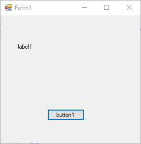

# HotKeyDialog

A (realy) simple library to use a kind of Messagebox for Windows Forms, which will detect the pressed keys and return it for easy assignatios of HotKeys



## Getting Started

Here is a solution with two projects on it. One is the actual .dll library and the other is a WindowsFormsApp for testing purposes.
You can find how to use the library in that proyect.


### How to use it

(In the solution you will find a project named _Example_ in which there are the two examples here explained)
First we will need to define the variable to storage the keypressed

```
HotKey hotkey = new HotKey();
```

Then we will show to the user the HotKeyDialog, so he will input the keycombination and we will get those keys returnted.

```
hotkey = HotKeyMessageBox.Show("Title", "Please press the key combination");
```

Full code
```
using HotKeyDialog;
...

 HotKey hotkey = new HotKey();

 if (HotKeyMessageBox.Show("Title", "Please press the key combination", out hotkey) == DialogResult.OK)
     label.Text = "You have pressed the keys: " + hotkey.ToString();
 else
     label.Text = "You have closed the dialog. There is no input";
```

### Installing

1. Download the _HotKeyDialog.dll_ and the open your project in visual studio
2. Go to **References** -> **Add** ->**Browse**
3. Then find the path where you downloaded the .dll and thats it.

### Dowloading

You can download the library from here [Release v1.0](https://github.com/PabloHorno/HotKeyDialog/releases/tag/v1.0)

## Authors

* **Pablo Horno** - *Initial work* - [PabloHorno](https://github.com/PabloHorno)

See also the list of [contributors](https://github.com/PabloHorno/HotKeyDialog/graphs/contributors) who participated in this project.

## License

This project is licensed under the MIT License - see the [LICENSE.md](LICENSE.md) file for details

## Acknowledgments

* Hat tip to anyone whose code was used
